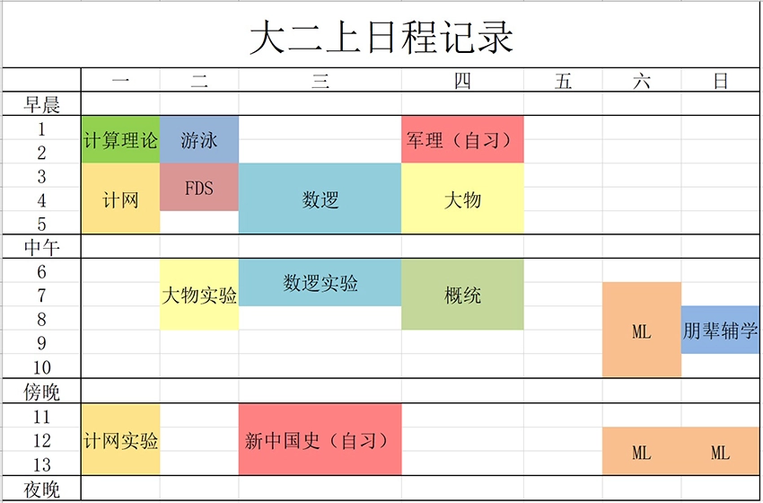
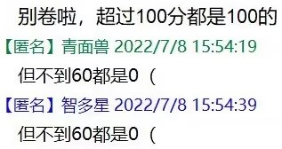
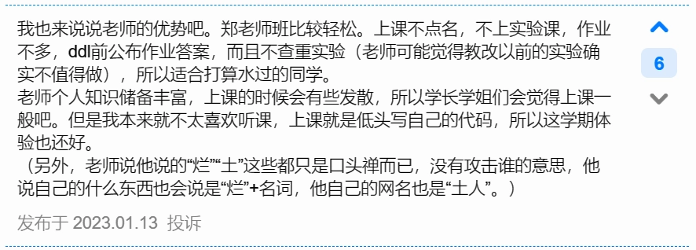
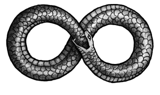

# ZJU CS 大二上课程体验（和谐版）

本文标题为“体验”而非“经验”。文中有很多对课程的主观感受，其他同学的感受不一定和我一样。

<!-- more -->

这学期开始，CS 的培养方案里终于有除了离散数学之外的专业课了。虽然不少同学大学上了一年到现在连 Git 都不会用，但也有一点学 CS 的感觉了。

我上大学以后才开始写代码，而且因为转专业免修了 C 大程，这学期算是我这辈子第一次学工科，非常缺乏经验。而且为了给大三省出更多时间做更重要的事，我这学期还提前修了两门大三的专业必修课——计网和计算理论，总体上有点压力。具体是什么程度的压力，就请看下面我对本学期课程的描述吧。

## 零、暑假短学期

### 课程综合实践1：超算集训

`学分 2.5` `老师 陈建海`

很不幸，这门课是我的计算机系统启蒙，但它不该是任何人的 system 启蒙，它是一门进阶课。

课程安排是：七天速通 408（指计算机考研专业课，含 DS、计组、OS、计网），用一个暑假做 lab，然后组队打 ICPC。这门课之于 ZJU 相当于 15-410 之于 CMU，在开课前教务处会发短信劝大家不要轻易选这门课，说这门课非常困难。但总有热情的大一同学（我）不信邪，想来超算锻炼一下自己。如果能坚持的话，在这门课里肯定能学到很多东西。我提前了解了很多高年级课程里的概念和思想，培养起阅读技术文档和动手做实验的好习惯，还学会了使用很多让我看起来更像 CS 人的工具（所谓 The Missing Semester of CS Education）。而且给分也是海底捞，出分之后我简直不敢相信我交上去跑得挺快但就是算不出正确结果的代码都能拿到分。

但如果让我重新选择，我大一短学期还是会选《计算机系统概论》。一方面因为超算这门课太硬了，会导致我这种比较菜的同学大量提问，愧对助教。另一方面这门课 ddl 一再延期，最后占用了一整个暑假。美好的大一暑假，我还是想趁着数学还没忘掉，尽可能学 CS231n 和 CS224n。

很庆幸自己好歹学会了 MPI 在 ICPC 的时候用上了，至少对自己和队友有个交代，不是完全没学明白。非常感谢耐心的助教们，答疑辛苦了！

## 一、CS 专业课大部队

### 数据结构基础（FDS）

`学分 2.5` `老师 陈越（陈越姥姥/cyll）`

这门课是典型的工科风 CS 课程，不难但质量相当高，让初学计算机的学生们能够在实现一种种数据结构的过程中快速提升工程能力。我认为比较高效的学习方法是直接用陈越姥姥的 MOOC 开二倍速自学，课后通过编程作业巩固。考前要刷往年真题，因为 CS 诞生这么多年来，像数据结构这种老牌基础课的题目已经被出烂了，很难有新题。

选课的时候同学们可能会被各种渠道了解到的查重往事吓到，但我强烈推荐选 cyll 班，理由如下：

* 姥姥班没有上机课
* 对于喜欢听课的同学来说，姥姥班的教学质量很高，FDS 的 MOOC 就是她录的
* 她给 bonus 非常大方，而且说话算数（有些老师是会到期末突然不给 bonus 的）
* 她很考虑学生感受，大程给的期限比较宽松，如果觉得时间太紧可以和她商量
* 给分大方的同时要求严格，坚持一学期下来会学到很多
* 查重并没有传言中的那么可怕，只要不是 100% 一样就没关系

如果有幸选了 cyll 班，请一定要注意非常遵守规则，认真读题目要求，看清楚 ddl，尤其是千万不能抄作业。我们这一届遇到的事情有：

* 第一次作业截止后十分钟就查重挂科了 8% 的同学
* 延毕两年的大六老哥被查重挂科，我校最多延毕两年，所以他没能毕业
* 一位大四学长期末考前才看课程群里的消息，发现自己早就被查重挂科了，没资格参加期末考，只能延毕
* 有人冬学期期末考前最后一周被查重挂科

抄袭的后果：“@被查重的同学, Do you have anything to tell me?”

### 数字逻辑设计（数逻+数逻实验）

`学分 4.0` `老师 王跃明`

这门课，从理论课内容来说，它是大量的数电 + 少量的计组 + 来源不明的零散知识；从实验课内容来说，它是大量的原理图 + 少量的 Verilog；从学习体验上来说，我宁可培养方案里没有这门课.

理论课，我们班王跃明老师很好，讲课非常认真，虽然不强制但还是想办法鼓励我们听课。不过因为这门课很多内容在短学期的《计算机系统概论》中讲过，所以我们大多不听课，对老师感到有些愧疚。

实验课和理论课有些脱节，而且实验指导比较奇怪，有很多莫名其妙问题需要助教帮助才能解决，按照正常学习进度完成实验有困难。而且我不是很理解为什么画了很多原理图之后很突然地换成 Verilog，而不是从一开始细水长流地学 Verilog。这学习曲线对我来说有些陡峭了，每次从东四-509 出来我都觉得我是波尔布特的弟弟——波尔布线。除此之外，长达数十页的实验报告非常费时间。之后的计组实验的体验就会比数逻好很多。

如果再来一次，我会这样学数逻：

* 在前一个暑假看完 CS61c 的 slides（没必要看视频，UCB 的 slides 质量就相当高了）
* 上 HDLBits 做题，对照菜鸟教程自学 Verilog，有条件的话自己弄一块板子玩，掌握一些硬件实验技能
* 期末考前读同学写的数逻笔记，查漏补缺那些细碎的知识

## 二、数理基础课程

### 大学物理乙2（大物乙）

`学分 3.0` `老师 武慧春`

武老师不强制听课，但很关心我们，小测前一周会提醒我们复习，过年还在课程群里发红包，提醒我们好好复习因为疫情延迟到开学的期末考。

既然被预置了大物乙，说明以后的课程里应该再也用不到物理了，但学校还是希望你多少学点。应付这种课，可参考《上海交通大学生存手册》中生存技巧章节的突击备考方法，我认识的人里有超过一位同学用这个方法满绩了。

### 大学物理实验（大物实验）

`学分 1.5`

1.5 学分的课搞出了 5 学分的工作量和 20 学分的教学事故。这门课平时都不太需要脑子，在这个意义上这门课很轻松；但它偏偏又要手抄实验报告，这就是多年不教改导致的纯粹体力活了。实验报告自己写往往不如抄前人的容易得高分，非常感谢咸鱼暄学长发在语雀上的优秀实验报告，以及前人发在 GitHub、公众号上的资料。

### 概率论与数理统计（概统）

`学分 2.5` `老师 郑志浩`

挺重要的一门课。文科社科生做科研需要用统计工具，CS 人发 AI 论文也离不开概率论。如果不幸选上了教学质量不高的班级，可以看 B 站上宋浩老师的公开课，或者买茆诗松老师的概统书自学。这门课前后难度变化很大，概率论部分翘课也没什么关系，可以从数理统计部分开始认真听课。郑老师本人很好，点名前一周甚至会提醒我们下周记得来现场上课，而且讲课很有激情。可惜这学期实在太累了，点名那一天我到场了但睡着了，痛失平时分。

## 三、CS 专业课自选餐

### 计算机网络（计网/CN）

`学分 4.5` `老师 郑扣根（土人）`

我个人认为这门课的内容安排得有点畸形。明明 CS 人只能动网络层以上的东西，网络层以下就是信电的工作了，但这门课却把网络层及以下当成重头戏，讲得又细又难，考试的时候还要狠狠地考。据迟策先生说，CMU 开给 MSCS 的计网会精讲网络层以上的内容，实验有手搓 TCP 什么的，我觉得那才是适合 CS 人的计网。互联网大厂面试 CS 人也就问问 TCP 的三次握手、四次挥手，哪会考什么香农第二定理呢？

幸运的是这门课是非常重要的专业课（上一段接这个句子怎么有点怪怪的？），有计算机系的学校都会开这门课，所以这门课的公开学习资源很丰富。中科大的计网很有名，但人家是“自顶向下方法”，和我校自底向上的顺序是反的，所以更推荐看咸鱼暄学长发在 B 站上的计网朋辈辅学自学。重中之重的是，期末考前一定要刷陆魁军老师的 100 题和《王道 408》！

我们这学期有两种班，一种是非教改，一种是教改，区别主要在于实验。非教改班做的是老实验；而教改班引入了 CS144 的优质实验。我们这届期末考前出了个小乌龙，通知说期末要考 __非__ 教改班的实验，给了教改班同学一点小小的计院震撼。

由于非教改班的实验和时代脱节，计网实验室里的网线又有很多都被往届学生咬坏了（土人老师原话），加上土人老师相信“计算机不是学出来的，而是玩出来的”，所以他只是给我们提供了一些网络“玩具”，对实验要求很低，给了我们自己探索的空间。非常感激土人老师教给我们的 CS 智慧。

査老师上的这一条是我写的⬇

我们下一届开始应该都是教改班了，祝大家好运，并且都能学到网络技术。

### 计算理论（ToC）

`学分 2.0` `老师 杨莹春`

大家已经学了两年的计算机，该回头来思考一下什么是“计算”了！这门课的内容和《哥德尔、艾舍尔、巴赫——集异璧之大成》很像，讲的是理论计算机（图灵机之类的）和计算机的理论能力极限，是一门非常浪漫的数学课。

现在毛宇尘老师回到母校来任教了，我校有专业对口的老师在讲授 ToC，以后的学习体验应该会很好。毛老师讲得又细致又深刻，上他的课有一种从上课思考到下课毫不间断的快乐和充实感。但选杨莹春老师班也有好处，她不像毛老师一样每年编写、批改、讲解新题，所以她的班 workload 很小。MIT 的计算理论公开课也很不错，他们的 slides 做得很好，适合复习的时候看。

我们这届是第一届教改。这次期末考和教改前其实差别没那么大，只是难度稍微大一点，然后有一道非确定性图灵机相关的大题。我以为不会考，复习的时候直接把 NTM 相关知识放生了（但凡我预修过 ADS 我都不会以为 NTM 不重要！），这题没拿到分；再加上这门课是数学课，期末考占比高，所以我有幸在这门课拿到了大学生涯最低绩点，和大一在数学院修的《高等代数与解析几何》并列最低。

### 机器学习和人工智能入门

`学分 3.0` `老师 杨易`

一开始选这门课是因为：

* 这门课是杨易老师开的，他是做 NLP 的大牛，而且是 CMU 毕业生，我想追星
* 据说会请 CMU 的老师给我们讲课
* 是国际化课程，能凑四课分

但实际上下来感觉正课像讲座，不是很深入，也没什么工程实践的东西可以学到。可能是因为这门课的定位是“入门”吧。作业的质量也很高，写了细致的 tutorial，保证只要愿意认真做就能做出来，能学到一些基础工具的用法。助教课质量也很高，助教备课特别认真，给我们讲了很多 AI 里的数学基础。

开课前听说会请 CMU 的老师给我们讲课，但实际上是通过校外机构请了 CMU 的老师通过 zoom 甚至是录播来给浙大和各种各样的二本三本一起上网课，不仅没能制造 connection，而且导致了外教课的难度只能向下兼容。那些二本三本都是什么我已经基本上忘了，似乎有个燕山大学，有个武汉纺织学院。不过幸运的是这门课每周都可以见到杨易老师本人，如果有合适的 idea 需要请求老师指导的话，选这门课制造见到老师的机会是很不错的选择。

## 四、语言学

### 英语文体学

`学分 2.0` `老师 朱晔`

在芭蕉姐姐的推荐下选的英语系专业课，讲的就是英文世界的各种文体。教学内容有趣，老师很 nice，而且文体学一定程度上能启发 NLP，但我还是上了两周就退了。一来文体学不是语言学六大支柱之一，二来这门课节奏不快，另外最大的问题是它被排在了数逻实验后一节课。我觉得每周都带着一身冷汗和低气压去外院楼上我最喜欢的语言学不太好。

## 五、学期总结

提前修读高年级课程，这件事本身不会太艰难，毕竟 CS 门槛并不如其他带电的工科高。但奈何本学期有 6 门要脑子的课，还附赠了一众很烧时间的水课，就算 CS 比数学和其他工科简单，我也顶不住课程丰富多彩（土人老师教导我们，CS 人要乐观面对屎山，可以描述成“多姿多彩”就别说它“又脏又丑”）。记得有一个冬天的早晨，四点做噩梦吓醒，然后到六点都没能再睡着，就爬起来吃早饭，赶第一班校车去玉泉。计网下课后，五分钟内就得从玉泉教 4 冲下楼到校车站，追上回紫金港的校车。因为学习消耗体力太多，前一晚还因为做噩梦没睡够，身体虚弱，从泉到港的这一点点车程都给我坐晕车了，当时真的很崩溃（现在想想真傻，为什么不问问学长们土人老师点不点名呢？其实他对学生可宽松了）。所幸一学期下来还是在学长学姐们的帮助和指导下顺利完成了课程，拿到了够用的 GPA。

除了空出一个比较轻松的大三上，这学期我还有一个比较大的收获，就是认识了许多优秀的 20 级学长们。提前修读课程的同学挺少，所以大三的课程群里出现一个活跃的大二同学就会很耀眼。20 级学长们掌握 CS 知识比我全面，而且在留学申请、暑研等方面也比我了解多更多信息，思维比我更成熟；更重要的是他们中的大部分从来没嫌弃我弱，反而乐于帮助我。我从他们身上学到许多。

感谢计算机学院即使没有什么功利的回报也依然认真对待教学的老师，还有不断传承经验与资源的学长学姐们。爱你们！
