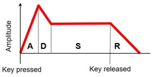
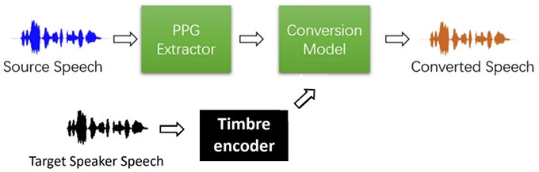
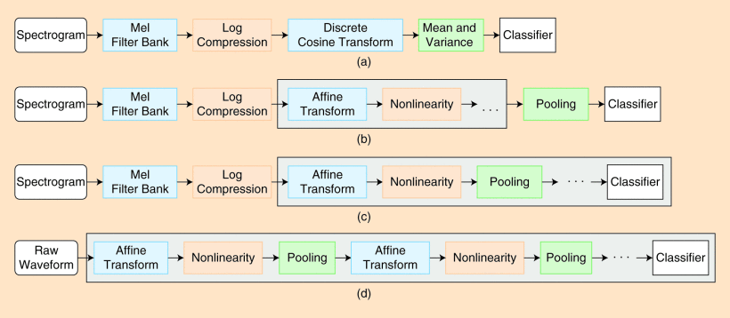
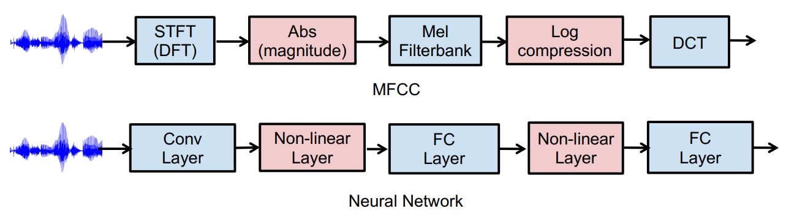
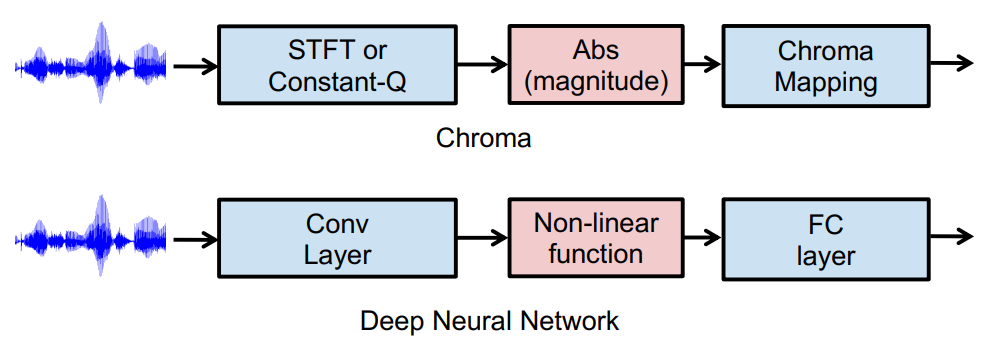

# DeepMIR-2023 Lec3 Timbre

## 1. General Idea

{align=right}

__Timbre__ (音色) allows a listener to distinguish musical tones, even if the tone is played at the same pitch and with the same loudness.

Timbre is very subjective. It can be described from:

* Temporal Characteristics: ADSR, that is attack (A), decay (D), sustain (S), and release (R)
* Spectral Characteristic:

    * Fundamental frequency (F0)
    * Partials (harmonics, formants): usually at frequencies which are integer multiples of F0

* Tremolo: periodic variations in amplitude (amplitude modulations)
* Vibrato: periodic variations in frequency (frequency modulations)

Monophonic Signal of Music = F0 (pitch + duration) + loudness + timbre. __Tone Transfer__ is a task to change the timbre and keep the frequency and loudness. To control the timbre generated, it is necessary to find representations of timbre easy to feed into neural networks. There are 4 ways:

* Timbre features (audio → features): Hand-crafted features, can be computed with equations or an algorithm, used as input to music classifiers in the early days
* Timbre classifier (audio → class): Classify music into hand-crafted categories, by song or by segment/second
* Timbre encoder (audio → embeddings): Some kind of "disentanglement" is needed, hard and not yet well studied in the literature
* Timbre decoder (embeddings → audio): The conversion model in the pic below, takes timbre-invariant embedding, add into timbre information, and generates singing voice

## 2. Representing Timbre: Signal Processing Perspective

The functions are provided in librosa. Measures of Spectral Shape:

* Spectral Centroid (譜質心): For each frame of a magnitude spectrogram, treat it as a distribution over frequency bins, and extract the mean (centroid) like calculating the centroid of an object in physics. Higher centroid values correspond to brighter textures, which indicates that the timbre contains more high frequencies.
* Spectral Contrast: Each frame of a spectrogram is divided into sub-bands. For each sub-band, the energy contrast is estimated by comparing the mean energy in the top quantile (peak energy) to that of the bottom quantile (valley energy). High contrast values generally correspond to clear, narrow-band signals, while low contrast values correspond to broad-band noise.
* Spectral Rolloff: The frequency for a spectrogram bin such that at least `roll_percent` (0.85 by default) of the energy of the spectrum in a frame is contained in this bin and the bins below. This function can be used to approximate the maximum (or minimum) frequency by setting roll_percent to a value close to 1 (or 0)
* Spectral Flux: How quickly the power spectrum of a signal is changing over time. Usually used for musical onset detection
* Mel-frequency cepstral coefficients (MFCC): Compact representation of the spectrum (1,024-dim → 128 or 13 coefficients) produced by taking the absolute value of STFT, applying Mel Filter Bank, Log Compression, and Discrete Cosine Transform (NOT necessary to understand this process). Somehow capture the relative strength of partials (分音) without knowing the F0. Less interpretable than other measures.

Spectral Features Can be Used to Build a Music Classifier

1. Compute the features per STFT frame (e.g. 13-D frame-level MFCC features)
2. Temporal pooling over time for each audio clip (e.g. by taking the mean and variance, leading to 26-D clip-level features)
3. Use that as input to a classifier

Limits: Clear physical meaning but not sophisticated enough, limited semantic meaning, and only the classifier is trainable

## 3. Representing Timbre: Deep Learning Perspective

The blocks inside the black lines are trainable, and the 4 methods are called: (a) Feature engineering, (b) Low-level feature learning, (c) Convolution neural networks, (d) End-to-end learning

Hand-designed steps in traditional ML can be replaced with trainable module:

