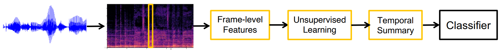
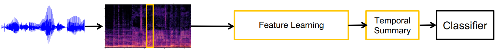
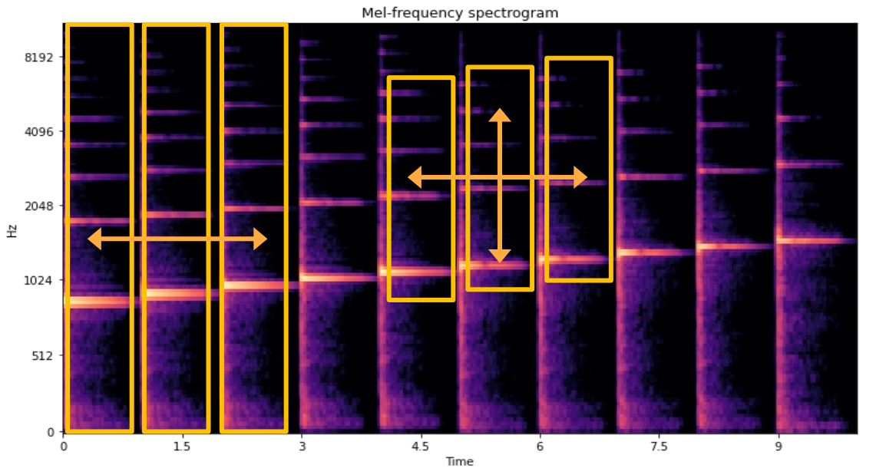
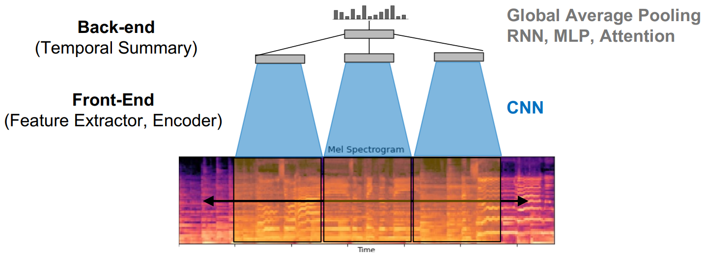

# Week2-4 Music Classification

For the details of vector representations of timbre, please refer to [this note of DeepMIR lec3](deepmir3.md). And I assume the readers know the classical ML & DL algorithms, including K-means and CNN.

Here is a [music classification tutorial](https://music-classification.github.io/tutorial/landing-page.html) by ISMIR.

## 1. Overview

Classification Tasks in Music Information Retrieval (MIR) research:

* Genre classification
* Mood classification
* Instrument classification
* Music tagging: all types of music attributes (genre, mood, instrument, ...)

General Pipeline: wav → Feature Extraction → Classifier → Output Class

In traditional music classification models, the feature extraction part includes transforming the wavforms into time-frequency representation, calculate hand-crafted audio features, and do feature summery to send into the classifier.

* Time-Frequency Representation: spectrogram, mel-spectrogram, constant-Q transform ...
* Hand-Crafted Audio Features: RMS (loudness), MFCC, Chroma, spectral statistics ...
* Feature Summary: Concatenate all audio features and summarize them over time, including statistical summary (average, max) and unsupervised learning algorithms (K-means, PCA)
* Classifier: Conduct supervised learning (K-NN, Logistic Regression, SVM, MLP) with the feature vectors and labels

In modern deep learning music classification models, the features are not hand crafted using domain knowledge, but "learned" through deep neural networks.

## 2. Traditional Machine Learning

Select a set of frame-level audio features, concatenate for a given task and feed into a classifier. The current baseline is MFCC + K-means (VQ) + Codebook histogram.

To get temporal summary of features in the whole song:

* Taking the entire frames of audio features over time is too large, 10 ~ 100 frame rates (frames per second) is typical in frame-level audio
* Temporal pooling (average, standard deviation): orderless summary
* Concatenating with frame-wise differences (delta and double-delta): capture local temporal changes (e.g., MFCC)
* DCT over time: take a small number of low-frequency cosine kernels for each feature dimension (1D DCT) or the entire feature dimension (2D DCT)

Unsupervised Learning:

* Dimensionality Reduction: Find correlation or redundancy patterns between data elements. e.g. PCA
* Clustering: Discover groups of similar examples with the data. e.g. K-means
* Density Estimation: Fit a probabilistic distribution model to data. The model can explain the likelihood of samples. e.g. GMM

Classifier:

* Conduct supervised learning with the feature vectors and labels
* KNN, Logistic Regression, SVM, MLP

## 3. Deep Learning

Feature Engineering in ML is changed into Feature Learning. The feature learning module can be implemented using different deep learning models. Librosa, pysox, and torchaudio are commonly used in DL for music.

CNN taking spectrograms can be used in music classification, for example, the [music recommendation of spotify](https://sander.ai/2014/08/05/spotify-cnns.html). In the front-end of the neural network, the CNN learn local musical features, and the local features are summarized by the back-end over time to get the global feature of the song.

1D and 2D convolutions are both feasible.

* 1D convolution covers the entire frequency range, contains less parameters and is faster to train, but is not invariant to pitch shifting.
* 2D translation is used only on the log-frequency scale (usually Mel-spectrogram), which makes harmonic patterns approximately shift-invariant, and contains more parameters to approximate more complex musical features.
* Overall, 2D convolution is more commonly used.

Commonly used digital audio effects in data augmentation:

* Pitch shifting
* Time-stretching
* Equalization
* Adding noises (e.g. Gaussian white noise)

Modern Topics of Music Classification:

* SampleCNN, HarmonicCNN: learning the filter bank directly from waveforms to avoid tuning STFT and log-scale parameters, and optimize to the specific task
* Representation Learning: Learn a feature extractor (or encoder) that transforms unorganized high dimensional input to low-dimensional organized feature in the audio embedding space
* Multi-modal Metric Learning: Learn co-embedding between audios, tags and images. Audio, word and vision subnetworks are individually trained to classify genres. The pretrained subnetworks are co-embedded using metric learning (triplet loss)

### Resourses

Pretrained music and audio classification models:

* [https://github.com/minzwon/sota-music-tagging-models](https://github.com/minzwon/sota-music-tagging-models)
* [https://github.com/jordipons/musicnn](https://github.com/jordipons/musicnn)
* [https://github.com/tensorflow/models/tree/master/research/audioset/vggish](https://github.com/tensorflow/models/tree/master/research/audioset/vggish)
* [https://github.com/marl/openl3](https://github.com/marl/openl3)

Popularly used music datasets:

* [GTZAN](http://marsyas.info/downloads/datasets.html)
* [Free Music Archive](https://github.com/mdeff/fma)
* [MagnaTagaTune](https://mirg.city.ac.uk/codeapps/the-magnatagatune-dataset)
* [Million Song Dataset](http://millionsongdataset.com/)
