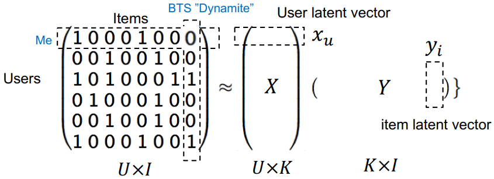
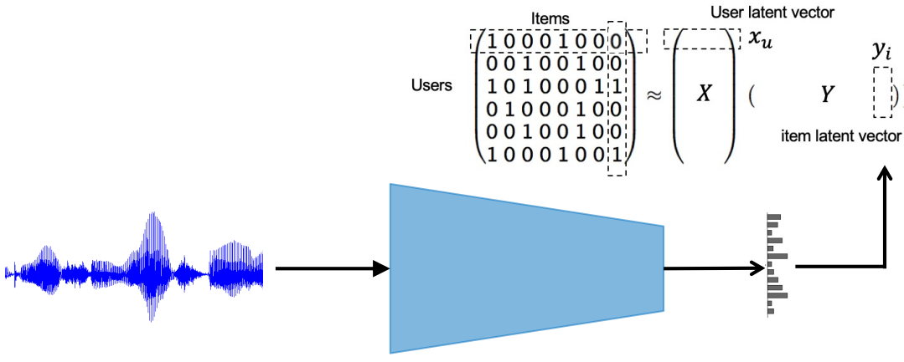
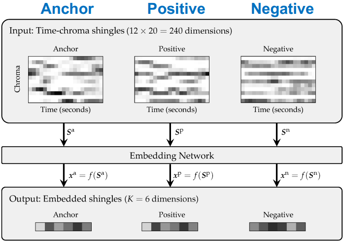

# Week5 Music Recommendation & Retrieval

## 1. Music Recommendation

__1.1 Collaborative Filtering__

Analyze the pattern of listening history (human signal). Weighted matrix factorization (WMF) is a common approach. In the picture below, the $K$ is the number of musical tastes, and $x_u^Ty_i$ is the preference of a specific user to a specific song.

Generally a good performance but there are two fundamental limitations:

* Cold-start problem: new items cannot be recommended
* Popularity bias: recommended songs are biased to the popularity

__1.2 Content-based Filtering__

Analyze the pattern of music content ("audio signal").Finding similar songs to those in a user's listening history. The similarity is measured by the distance between song labels generated by music classification models.

This method is not biased to the popularity and good for music discovery. But it also has limitations:

* Recommended songs are not necessarily satisfying (e.g. too minor music)
* Need high-quality labels for training the model

__1.3 Content-based Collaborative Filtering__

Use "item latent vectors" from collaborative filtering as labels. It resolves the cold start problem and requires no labeling cost.

## 2. Music Retrieval

Search songs that match to the query. The query can be text or audio. Depending on the __specificity__ on the query, from high to low, there are various ways of retrieving songs:

* Music Identification
* Version Identification
* Similar Music Identification
* Genre/Mood Classification

Audio Fingerprint is the unique audio patterns of individual music tracks. We can search the song identical to the audio query using hash tables according to the patterns. Shazam uses dominant peaks on spectrogram (robust to interfering noises).

Cover Song Detection: Estimate the dominant melody, map into embedding space, and learn metric with a triplet loss. Version Identification is a similar task to retrieve different performers' recordings of the same classical piece. Use chroma features as the input of the shared embedding network and learn metric.

Specificity of similarity notion can control the specificity of embedding space. For different requirements of music retrieval, we can choose different features, including artist, album and track information.
