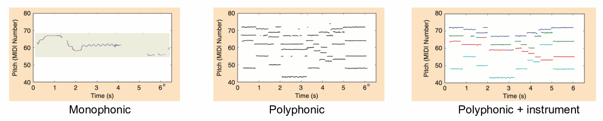

# Week7-10 Automatic Music Transcription

TBC: 这份笔记还非常欠整理！

AMT Tasks:

- Pitch Estimation (frame-level):
  - Monophonic: From a single sound source.
  - Polyphonic: From multiple sound sources.
  - Melody Estimation: Single melodic pitch estimation from multiple sound sources.

- Note Transcription (note-level): Based on frame-level pitch estimation, identifies a note by detecting the onset and offset.
- Sheet Music Generation: Based on note transcription, requires additional information like metric analysis, key detection, notes, and expressions.

## 1. Monophonic Pitch Estimation

When a tone is generated with a pitch, the waveform is periodic and the spectrum is harmonic. Pitch is often referred to as fundamental frequency or "F0" (F0 = 1 / period).

- Traditional Approaches:
  - Time-Domain Approach: Estimate the period of the waveform.
  - Frequency-Domain Approach: Exploit the harmonic pattern.
- Methods:
  - YIN: Based on normalized AMDF.
  - CREPE: A state-of-the-art pitch estimation using CNN.
- Post-Processing:
  - Median filtering.
  - Viterbi decoding.

Melody Extraction

- Definition: Extracting melodic pitch contours from polyphonic music.
- Methods:
  - Salience-Based Approach: Utilizing a saliency function.
  - Source Separation Approach: Separating the melodic source and using monophonic pitch estimation.
  - Classification-Based Approach: Utilizing CNN or CRNN.

Recurrent Neural Networks (RNN) and Long Short-Term Memory (LSTM)

- RNN:
  - Have connections between previous states and current states of hidden layers.
  - Can have issues with exploding or vanishing gradients.
- LSTM:
  - Designed to avoid the long-term dependency problem.
  - Contains four neural network layers in one module.
  - Utilizes a cell state to allow information to flow through without change.
  - Employs sigmoid gates to control the flow of information.

Singing Melody Extraction

- Approach: Joint learning of singing voice detection and vocal pitch estimation.
- Vocal Pitch Classification:
  - Utilizes CRNN with ResNet stacks and Bi-directional LSTM-RNN.
  - Employs Gaussian blurring in the output layer.
- Singing Voice Detector:
  - Uses shared features from the pitch classifier.
  - Employs Bi-directional LSTM-RNN.

## 2. Multi-Pitch Estimation & Note Transcription

Multiple Pitch Estimation: Polyphonic pitch estimation from multiple sound sources.

AMT Model Challenges

- Many sources are mixed and played simultaneously.
  - They are likely to be harmonically related in music.
  - Some sources can be masked by others.
  - Content changes continuously by musical expressions (e.g. vibrato).
- Labeling is time-consuming and requires high expertise.
  - Supervised learning is limited (piano transcription is a special case).
  - Sheet music can be used as “weak” labels with the score-to-audio alignment.
  - Multi-track recording with monophonic pitch estimation.

Methods

- Iterative F0 search: DSP.
- Joint source estimation: NMF.
- Classification-based approach: ML/DL.

Iterative F0 Search

- Repeatedly finds predominant-F0 and removes its harmonic overtones.
- Procedure:
  1. Set the original to the residual.
  2. Detect a predominant F0 based on pitch templates.
  3. Spectral smoothing on harmonics on the detected F0.
  4. Cancel the smoothed harmonics from the residual.
  5. Repeat steps 2 & 3 until the residual is sufficiently flat.

NMF-based Spectrogram Decomposition

- Spectrogram can be approximated with an additive sum of pitch templates and the corresponding temporal activations.
- They can be regarded as a non-negative matrix factorization.

Classification-based Approach

- Quantize the pitch output into discrete label vectors.
- Multi-label classification.
  - 88 binary state output (note on/off).
  - Use the sigmoid output.
- No prior knowledge of musical acoustics.

Note-Level Transcription

- Convert continuous pitch streams into note events.
  - Use the frame-level pitch estimation.
  - Explicit onset detectors can be added but they are very hard.
  - Note modeling algorithms to prune, merge, and divide frame-level predictions.
    - Rule-based approach: thresholding, median filtering.
    - Statistical approach: HMM.

Onsets and Frames

- Joint learning of onset detection and pitch estimation for polyphonic piano transcription.
  - Two CRNN branches.
    - Onset network: detect the onset of multiple notes.
    - Frame network: detect on/off states of multiple notes.
  - A connection from the onset prediction in the onset network to the input of RNN in the frame network.

Autoregressive Multi-State Note Model

- Use a single CRNN with the softmax output that predicts multiple note states at once (off, onset, sustain, offset, and re-onset).
  - Autoregressive unidirectional RNN for real-time inference.

U-Net based Multi-Instrument AMT

- CNN-based Encoder-Decoder.
  - Proposed for image segmentation.
  - Use it for “note segmentation”.
  - Self-attention for instrument detection.

Seq-to-Seq Model

- A generic encoder-decoder Transformer with standard decoding methods.
  - Represents the MIDI output with text-based token sequences.

MT3

- The same seq-to-seq model that supports multi-task AMT.
  - Add the “program change” token to the output to change instruments.
  - This allows the model to handle an arbitrary number of instruments.

Datasets

- Piano:
  - MAESTRO: large-scale real performance.
  - MAPS: synthesized piano.
  - Saarland Music Data (SMD): real performance.
- Multi instrument.

## 3. Audio-to-Score Alignment

Score and Performance

- MIDI (score)
- Differences in performances (e.g., Valentina Lisitsa vs Vladimir Horowitz)
  - Tempo variations
  - Dynamics (volume, note-level accent)
  - Articulations (legato, staccato)
  - Timbre variations

Audio-to-Score Alignment

- Aligning audio and score in a piece of music
- Can also be audio-to-audio or MIDI-to-MIDI
- Applications:
  - Performance analysis
  - Performance assessment
  - Score following (real-time alignment)
  - Automatic labeling for automatic music transcription tasks

Algorithm Overview

- Convert score (MIDI) to audio using a synthesizer
- Extract audio feature sequences from waveforms
  - Chroma feature commonly used
- Compute similarity matrix between two audio feature sequences
- Find optimal alignment path using dynamic time warping (DTW)

Dynamic Time Warping (DTW)

- Finds the optimal path of length L that has minimum cost in an N x M matrix
- Conditions:
  - Boundary condition: p1=(1,1), pL=(N,M)
  - Monotonicity condition
  - Step size condition (move upward, rightward, or diagonal upper-right)

Audio Feature Extraction

- Chroma feature captures timbre-invariant tonal characteristics
- CENS: Normalized Chroma Features

Similarity Matrix

- Compute distance between all pairs of frame-level feature sequences
- Use Euclidean or cosine distance

Finding the Optimal Alignment Path

- Numerous possible paths from one corner to another
- Finding optimal alignment path is like searching for a trail route with minimum efforts when hiking

Dynamic Programming for DTW

- Algorithm involves initialization, recurrence relation, and termination
- Minimum cost is computed using a specific equation
- Minimum-cost path can be found by tracing back the computation

Application: Performance Analysis

- Visualization of tempo and dynamics in piano performances
  - [PerformScore Visualization](https://jdasam.github.io/PerformScore/)

Online DTW

- DTW works offline, but what if we want to align audio to score in real time?
- Procedures include setting a moving search window and calculating cost only within the window
- Movement is determined by the position that gives a minimum cost within the current window

Review of Pitch Estimation

- Can be viewed as a task that finds the best pitch sequence from audio stream
- Pitch estimation algorithms usually rely on local predictions
- Can we jointly predict the entire pitch sequence?

Hidden Markov Model (HMM)

- Hidden states based on the Markov model
- Given a state, the corresponding observation distribution is independent of previous states or observations

Learning HMM Parameters

- HMM parameters include initial state probabilities, transition probability matrix, and observation distribution
- If labels are aligned with audio, estimate them directly from training data and local estimation

Evaluating HMM

- Find the most likely sequence of hidden states given observations and HMM parameters using dynamic programming

Viterbi Decoding

- Define a random variable that maximizes the probability at a certain state
- Involves initialization, recursion, and termination
- Post-processing for pitch estimation

## 4. Rhythm Transcription

 Introduction

- Definition: Automatic Music Transcription (AMT) is the process of converting an acoustic musical signal into some form of musical notation.
- Challenges: Polyphonic music transcription is considered one of the most challenging problems in the field of Music Information Retrieval (MIR).

 Rhythm Transcription

- Rhythm: The pattern of sounds and silences in music, involving the aspects of timing and beat.
- Importance: Rhythm is a fundamental aspect of music and is crucial for understanding the temporal structure of a musical piece.

 Onset Detection

- Definition: Identifying the beginnings of musical events.
- Importance: Onset detection is the first step in rhythm transcription and is crucial for further analysis like beat tracking.
- Methods: Various methods are used for onset detection, including spectral flux, phase deviation, and complex domain methods.

 Temporal Analysis

- Objective: To analyze the temporal structure of a musical piece.
- Methods: Different methods are used for temporal analysis, such as autocorrelation, comb filter, and Fourier tempogram.

 Beat Tracking

- Definition: Determining the times at which beat events occur.
- Importance: Beat tracking provides a temporal grid that can be used for further rhythmic and structural analysis of the music.
- Methods: Different algorithms are used for beat tracking, including dynamic programming and probabilistic models.

 Evaluation Metrics

- Objective: To measure the performance of rhythm transcription systems.
- Metrics: Various metrics are used for evaluation, including F-measure, Cemgil’s accuracy, and Goto’s accuracy.

 Applications

- Music Information Retrieval (MIR): AMT is used for retrieving music information and is crucial for various MIR tasks.
- Music Education: AMT can be used as a tool to assist in music education, helping students and teachers in understanding and learning music.
- Music Production: AMT can be utilized in music production for tasks like editing and arranging music.

 Conclusion

- AMT is a challenging problem due to the complexity of musical signals and the diversity of musical genres.
- Rhythm transcription, which includes onset detection, temporal analysis, and beat tracking, is crucial for understanding the temporal structure of music.
- Various methods and algorithms have been developed for rhythm transcription, and it has various applications in MIR, music education, and music production.

## 5. Chord Recognition

 Introduction to Chords

- Chord: A harmonic set of multiple notes that accompany the melody, providing perceptual and emotional richness.
- Musical Progress: A sequence of chords forms a progression, e.g., I-V-I, I-ii-V-I.
- Consonance and Dissonance: Two sinusoidal tones are dissonant if their frequencies are within 3 semitones (minor 3rd). Consonance and dissonance between two harmonic tones are determined by how much their harmonics overlap within critical bands.

 Chord Construction and Scales

- Chords are formed by stacking major or minor 3rd intervals, resulting in triads, 7th chords, 9th chords, etc.
- Major Scale: Formed by spreading notes from three major chords.
- Minor Scale: Formed by spreading notes from three minor chords, with variations like harmonic or melodic minor scales formed using both minor and major chords.

 Tonal Music

- Tonal music, which comprises the majority of music, has a tonal center called a key (tonic note).
- There are 12 keys (C, C#, D, …, B), and each note on the scale has a different role determined by its relation with the tonic note.

 Automatic Chord Recognition

- Traditional Methods: Include template-based pattern matching.
- Classification-based Methods: Involve supervised learning using a classification model, with outputs being one-hot class of chords or a structured form.

Template-based Pattern Matching

- Utilizes the similarity between chord vector and binary templates for each chord.
- Employs correlation (inner product) between chroma vectors and templates.
- Frame-based prediction from the maximum correlation values does not consider the temporal dependency of chord progressions.

Hidden Markov Model (HMM) for Chord Recognition

- Uses Viterbi decoding with local prediction from chord template matching, transition probability calculated as chord labels (chord progression), and initial probability as chord distribution.

 Deep Chroma

- Supervised feature learning of chroma, using 15 frames of quarter-tone spectrogram as input and employing Multi-Layer Perceptron (MLP) with 3 dense layers of 512 rectified units.
- Output: Chord labels.
- Deep Chroma vs. Hand-Crafted Chroma: Deep Chroma offers precise pitch activations and low noise while maintaining crisp chord boundaries.

 Chord Recognition: CRNN

- CRNN-based chord recognition uses the Gated Recurrent Unit (GRU) for RNN.
- Structured chord labels represent the chord notation with binary vectors of root, pitch, and bass fields, with root and bass fields using softmax and the pitch field using sigmoid.

 Resources

- [Chordify](https://chordify.net/)
- Software: [Madmom](https://madmom.readthedocs.io/)
