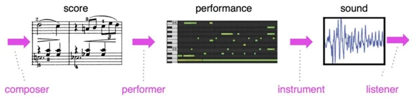
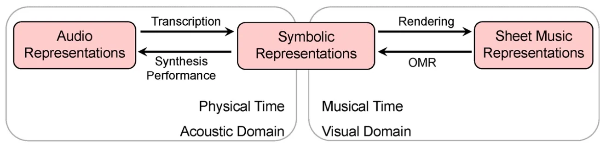
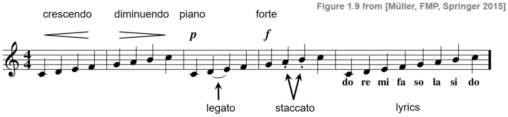

# Lec2 Representations for Music

At each stage of the music performing pipeline, different representations are needed. The formats of music in the pic above, from left to right, are sheet music, symbolic representation and audio representation.

## 2.1 Sheet Music & Symbolic Representations

Traditional __sheet music__ supports and music timing score only, and can be stored in __MusicXML__ format. Musicians may vary the tempo, dynamics, and articulation, resulting in a personal performance of the given musical score. So sheet music is rarely directly used as input to neural network models.

Piano roll is a kind of __symbolic representation__ as a visual, image-like representation of music, and can be stored in __MIDI__ format. It can contain rich performance information and supports both score and performance, either music timing (after quantization) or absolute timing. It is more convenient to be used as input to neural networks, and datasets of MIDI files are easily accessible.

Tools:

* [MusPy](https://salu133445.github.io/muspy/index.html) is an all-in-one lib for symbolic music generation.
* [PyPianoroll](https://salu133445.github.io/pypianoroll/) can intuitively manipulate MIDI files as piano rolls.
* [Miditoolkit](https://github.com/YatingMusic/miditoolkit) is designed for handling MIDI in symbolic timing (ticks), which is the native format of MIDI timing.
* [PrettyMIDI](https://github.com/craffel/pretty-midi) can parse MIDI files and generate pianorolls in absolute timing.
* [MidiTok](https://github.com/Natooz/MidiTok) can take care of converting (tokenizing) your MIDI files into tokens, ready to be fed to models such as Transformer, for any generation, transcription or MIR task
* MuseScore is a software that can manipulate the music files in MIDI, MusicXML and audio formats.

## 2.2 Audio Representation

Audios also have 2 kinds of representations. They can be visualized as __waveforms__ stored in *.wav files, but it does not show the components with different frequencies in the audio. By applying discrete short-time fourier transform and other transforms, the waveform can be transformed into time-frequency representation, called __spectrogram__.

Audio Representations in Spectrogram:

* Short-Time Fourier Transform (STFT): directly generated by applying discrete short-time fourier transform to waveforms, represent linearly-spaced time, magnitude and frequencies
* Constant-Q Transform (CQT): logarithmic frequency, logarithmic magnitude
* Pitch Class Profile / Chromagram: a 12-element feature vector indicating how much energy of each pitch class, {C, C#, D, D#, E, ..., B}, is present in the signal, ignoring the octaves
* Mel-Spectrogram: the mel scale is a perceptual scale of pitches judged by listeners to be equal in distance from one another, with finer resolution in the low-frequency range (NOT exactly logarithmic scale)

Different spectrograms are used as input to CNN to deal with different tasks of music feature extraction.

* Timbre representation: Spectrogram → Mel-Spectrogram → MFCC
* Pitch representation: Spectrogram → CQT → Chroma Feature

Dataset:

* [Freesound](https://www.freesound.org)

Tools:

* [Sonic Visualiser](http://www.sonicvisualiser.org/) is like an Adobe Audition adapted for music
* [librosa](https://librosa.org/doc/latest/index.html) is a acoustic python package for music and audio analysis
* [torchaudio](https://pytorch.org/audio/0.11.0/tutorials/audio_feature_extractions_tutorial.html) implements feature extractions commonly used in the audio domain

## 2.3 Math in STFT: Frequency & Temporal Resolution

TBC

## Summary

<figure markdown>

<figcaption>Representations of Musical Scores and their Relations</figcaption>
</figure>

Terminologies:

??? "Sheet Music"
    * meter: 節拍
    * tempo: 節奏, measures the speed
    * dynamics: 力度, measures how hard a part of music is played
    * articulation: 奏法
    * Articulation Marks: denote how certain notes are to be played, including marks in the pic below
    

??? "Piano Roll"
    * MIDI note number (0-127): pitch of the sound, can be calculate using the fundamental frequency of the note
    * Key velocity (0-127): intensity, not speed
    * MIDI channel: different instruments
    * Time stamp: how many clock pulses or ticks to wait before the command is executed
    * Clock pulses / ticks: basic time units subdivided from quarter notes
    * Pulses per quarter note (PPQN): commonly 120, determines the resolution of the time stamps associated to note events

??? "Audio Representation"
    * mono & stereo, monaural & binaural
    * Pitch class: Two notes with fundamental frequencies in a ratio of any power of two, which means they differ by octaves, are perceived as very similar. All notes with this kind of relation can be grouped under the same pitch class. e.g. pitch class C = {..., C2, C3, C4, ...}
