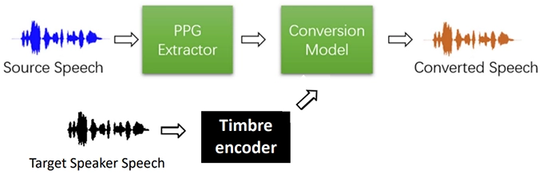

# Lec3 Timbre

## 3.1 General Idea

{align=right}

Timbre (音色) allows a listener to distinguish musical tones, even if the tone is played at the same pitch and with the same loudness.

Timbre is very subjective. It can be described from:

* Temporal Characteristics: ADSR, that is attack (A), decay (D), sustain (S), and release (R)
* Spectral Characteristic:

    * Fundamental frequency (F0)
    * Partials (harmonics, formants): usually at frequencies which are integer multiples of F0

* Tremolo: periodic variations in amplitude (amplitude modulations)
* Vibrato: periodic variations in frequency (frequency modulations)

Monophonic Signal of Music = F0 (pitch + duration) + loudness + timbre. __Tone Transfer__ is a task to change the timbre and keep the frequency and loudness. To control the timbre generated, it is necessary to find representations of timbre easy to feed into neural networks. There are 4 ways:

* Timbre features (audio → features): Hand-crafted features, can be computed with equations or an algorithm, used as input to music classifiers in the early days
* Timbre classifier (audio → class): Classify music into hand-crafted categories, by song or by segment/second
* Timbre encoder (audio → embeddings): Some kind of "disentanglement" is needed, hard and not yet well studied in the literature
* Timbre decoder (embeddings → audio): The conversion model in the pic below, takes timbre-invariant embedding, add into timbre information, and generates singing voice

## 3.2 Representing Timbre: Signal Processing Perspective

The functions are provided in librosa.

TBC
