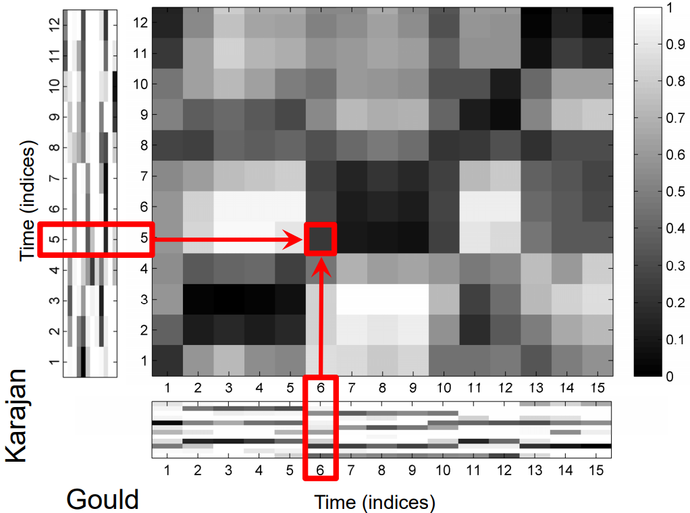
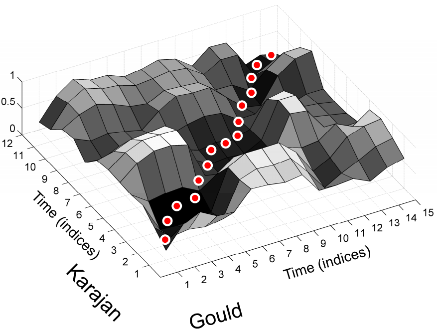
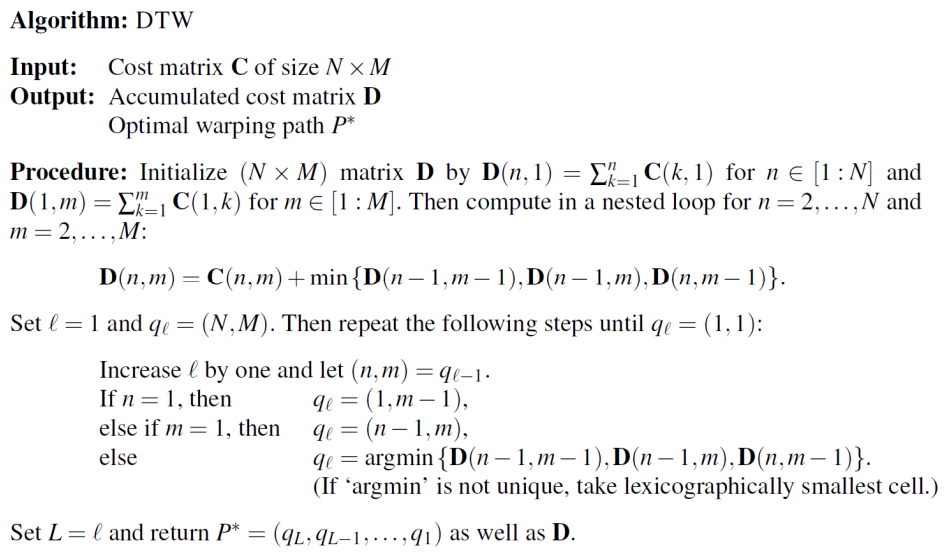
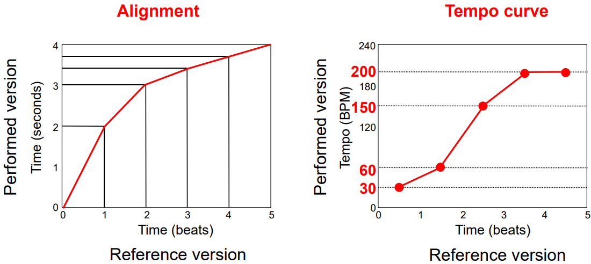
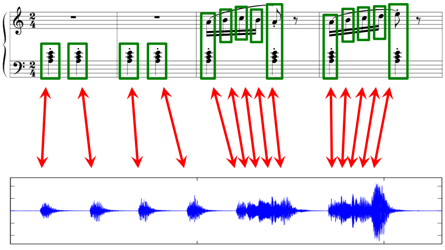
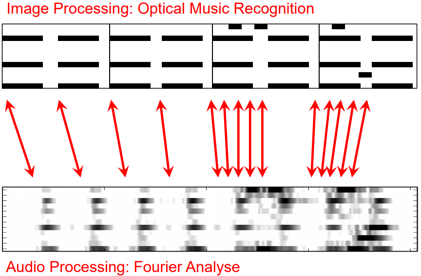

# 4. Music Synchronization

This task is about alinging different representations of the same piece of music, for example, aligning sheet music to waveform.

## 4.1 Audio-Audio

Given two different audio recordings of the same underlying piece of music, find for each position in one audio recording the musically corresponding position in the other audio recording.

Application: Interpretation Switcher

Procedure:

1. Extract audio features: Especially chroma features, which is robust to variations in instrumentation, timbre, dynamics, and correlate to harmonic progression
2. Alignment: Need to deals with local and global tempo variations

The evaluation of alignment is done by finding a route in the cost matrix.

In the cost matrix above, two versions of Beethoven's Fifth are represented in chroma, and multiplied with each other bin by bin. If the multiply of 2 bins is large, indicating that the 2 bins contain similar audio information, the corresponding grid in the cost matrix will be dark. To align the two versions of Beethoven's Fifth is to find a route from bottom-left to up-right that crosses dark grids as much as possible.

The optimal route can be find using Dynamic Time Warping (DTW).

## 4.2 Dynamic Time Warping

DTW is a well-known technique to find an optimal alignment between two given (time-dependent) sequences under certain restrictions. Originally used to compare different speech patterns in ASR.

It is just dynamic programming with a fancy name. Not gonna take this note.

## 4.3 MIDI-Audio

MIDI can be converted to piano roll, and then to chroma. Then use the method in 4.1.

Applications:

* Automated audio annotation
* Accurate audio access after MIDI-based retrieval
* Automated tracking of MIDI note parameters during audio playback
* Performance analysis

Performance analysis includes plotting the Tempo Curve. The average tempos at several stages are calculated from the alignment at several time points, and the tempo curve is optained by interpolation.

Lyrics-Audio alignment is hard to implement directly, so it is divided into two parts: Lyrics-MIDI + MIDI-Audio.

## 4.4 Image-Audio

Application: Score Viewer

It is hard to directly align them, so convert data into common mid-level feature representation. Use Optical Music Recognition to read sheet music and convert to piano roll, then to chroma, and then use 4.1 method again.

