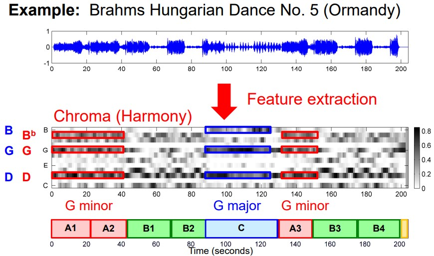
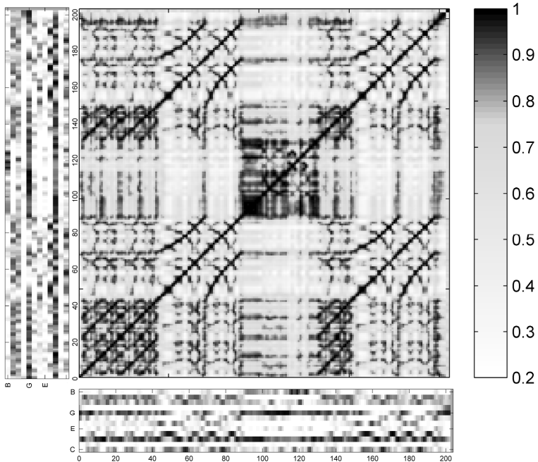
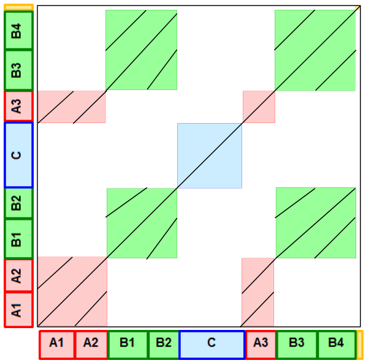

# 5. Music Structure Analysis

## 5.1 Introduction

General goal: Divide an audio recording into temporal segments corresponding to musical parts, and group these segments into musically meaningful categories.

Examples:

* Stanzas of a folk song
* Intro, verse, chorus, bridge, outro sections of a pop song
* Exposition, development, recapitulation, coda of a sonata
* Musical form ABACADA ... of a rondo

Challenge: There are many different principles for creating relationships that form the basis for the musical structure.

* Homogeneity: Consistency in tempo, instrumentation, key, ...
* Novelty: Sudden changes, surprising elements ...
* Repetition: Repeating themes, motives, rhythmic patterns ...

Feature Representations: Convert an audio recording into a mid-level representation that captures certain musical properties while supressing other properties

## 5.2 Self-Similarity Matrix (SSM)

General idea: Compare each element of the feature sequence with each other element of the feature sequence based on a suitable similarity measure.

e.g. Brahms Hungarian Dance No. 5 (Ormandy)

The corresponding idealized SSM (which can be approximated using SSM enhancement) exaggerating the important features looks like:

* Blocks: Homogeneity
* Paths: Repetition
* Corners of Blocks: Novelty

According to these features in SSMs, we can divide music into finer structures: A1, A2, B, ...

Tool: MATLAB Similarity Matrix Toolbox

## 5.3 Audio Thumbnailing

General goal: Determine the most representative section ("Thumbnail", often assumed to be the most repetitive segment) of a given music recording.

TODO: path family
