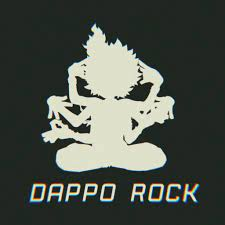

# FreshBoy's Homepage

Currently I am a CS undergraduate at [Zhejiang University](https://www.zju.edu.cn/english/), interested in everything related to sound and language, including phonetics, speech, NLP, music tech, etc.

I have begun listening to Vocaloid by some producers I love when I was in junior middle school, and that is when I became truly interested in music. After being admitted into high school, I encountered an online linguistics course for high school students called [十二周入门语言学](https://www.bilibili.com/video/BV1ds411f7Yk/) by Dr. 小蝶, and it helped me discover my enthusiasm about human language. On the recommendation of some of my high school classmate, I read [数学之美](https://book.douban.com/subject/35033507/) by Dr. 吴军, and was deeply impressed by the algorithms used to process human language. Now I am seeking for a further study or a job in the regions I like.
