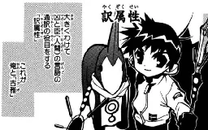

# Middle Chinese Pronunciation 中古漢語語音

This is the note of [Middle Chinese Pronunciation Tutorial](https://www.youtube.com/watch?v=djTrdguRzOI&list=PL3D56C369F16E43D0) by Dr. Polyhedron. His this course is about the pronunciation of the middle Chinese language, the ancestor of most of the Sinitic languages today, and the system of Middle Chinese Pinyin used to conveniently annotate the pronunciation of middle Chinese.

## What is Middle Chinese?

It is the Chinese language at the middle stage, used roughly between the Three Kingdoms Period and Song Dynasty.

## Why Need to Learn?

{align=right}

If you want to learn many Sinitic languages (excluding Hokkien) and Sino-Xenics, it will save you much effort of memorizing the pronunciation of Chinese characters. After learning the phonology of middle Chinese, you will be able to easily infer the pronunciation of Chinese characters in most modern languages using Chinese characters, because they have evolved from the pronunciation of middle Chinese.

Also, many kinds of Chinese historical documents, including Tang poetry, are written using rhymes of middle Chinese. If you learn the pronunciation of middle Chinese, it will be easier for you to study them.

## How was the Pronunciation Determined?

The phonology can be determined using the rhyming books (韻書). However, we can dig out the dead and ask them to pronounce each character for us, so the phonetic values of each phoneme remain to be inferred from the pronunciation of modern Sinitic languages and Sino-Xenics and some other clues found in historical documents. In other word, the phonetic values are not guaranteed to be true. So it is rational to memorize the onset, rhyme and tone __classes__ of every character, not the inferred phonetic values.

## More About this Course

The phonetic system taught in this course is that of _Qie Yun_ (《切韻》) by Fayan Lu (陸法言), because it is the earliest undisputed officially-formulated rhyming book of Middle Chinese, recording the phonology of the Northern and Southern Dynasties period scholars. Many later rhyming books were based on _Qie Yun_.

Middle Chinese Pinyin introduced in this course is just a convenient way to annotate the pronunciation of middle Chinese, not the same as IPA.

For convenience and to avoid ambiguity, the following notes will be written in traditional Chinese (繁體中文).
