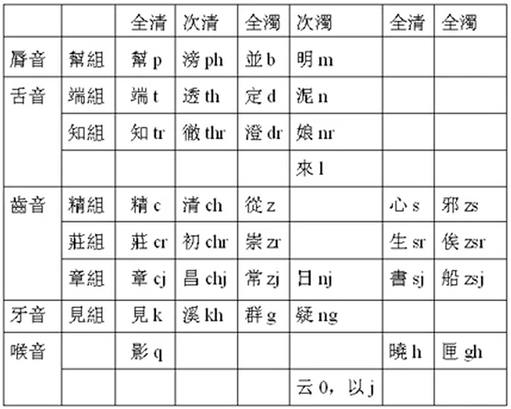

# Onset 聲母

中古漢語的聲母按照發音部位來區分，分爲：唇、齒、舌、牙、喉音五類。這五類又可以繼續細分為「組」，每個組用起始的聲母命名。

此外，它們還可以按照清濁和其他語音特徵分爲以下四類：

* 全清：不送氣清塞音 + 清擦音
* 次清：送氣清塞音
* 全濁：濁塞音 + 濁擦音
* 次濁：鼻音 + 邊音 + 近音 + 零聲母

中古漢語拼音對聲母選用的字母中：

* 清聲母：p、t、c、k、q、s、h，其中第二字母為 h 者次清，其餘全清
* 全濁：b、d、z、g
* 次濁：m、n、l、j、i、y

## 唇音

唇音在切韻時代只有四個，並且擬音結果基本沒有爭議。注意「並」不可以寫成簡體字的「并」，因爲繁體字中這兩個字是不同的語素，而且「并（pjeng）」的聲母並不是並母。

||全清|次清|全濁|次濁|
|-|-|-|-|-|
|聲母|幫|滂|並|明|
|中古漢語拼音|b|ph|p|m|
|代表字發音|pang|phang|bengx|mieng|
|擬音|/p/|/pʰ/|/b/|/m/|

並母字在普通話中全部清化，其中平聲字並入滂母，仄聲字并入幫母。

後來的中古漢語的唇音演化出了雙唇音（重唇音）和唇齒音（輕唇音），分別是 /p/、/pʰ/、/b/ 和 /f/、/v/ 這兩組音。在幫、滂、並、明母中各有一部分三等字變爲輕唇音。普通話中是中古漢語拼音為 (p,ph,b) + (i,y) + (a,o,u) 和 m + (i,y) + (a,o) 的字演變爲輕唇音，其餘保留重唇；明母字變輕唇音，先變爲 v 聲母，後來與其他 w 聲母的字混同。

因此，切韻音系中聲母為唇音的字在普通話中的聲母如下：

||幫|滂|並|明|
|-|-|-|-|-|
|重唇|b|p|平p，仄b|m|
|輕唇|f|f|f|w|

??? 幫組例字
    * 幫母：波pua、非pyoi、不pyot、半puanh、巴pra、八pret、表pieux、北pok、風piung、反pyanx
    * 滂母：破phuah、普phox、潘phuan、篇phjen、芳phyang、匹phjit、片phenh、拂phyot、攀phran、扑phuk
    * 並母：房byang、平bieng、白brak、伐byat、父byox、病biengh、浮biu、盤buan、步boh、薄bak
    * 明母：無myo、未myoih、文myon、民mjin、莫mak、周myonh、武myox、馬mrax、物myot

## 舌音

舌音有兩組，端組稱爲舌頭音，知組稱爲舌上音。來母傳統上稱作半舌音。知組的擬音有爭議，不確定是舌面音還是捲舌音。

||全清|次清|全濁|次濁|次濁|
|-|-|-|-|-|-|
|聲母|端|透|定|泥|來|
|中古漢語拼音|t|th|d|n|l|
|擬音|/t/|/tʰ/|/d/|/n/|/l/|

||全清|次清|全濁|次濁|
|-|-|-|-|-|
|聲母|知|徹|澄|娘|
|中古漢語拼音|tr|thr|dr|nr|
|擬音1|/ȶ/|/ȶʰ/|/ȡ/|/ȵ/|
|擬音2|/ʈ/|/ʈʰ/|/ɖ/|/ɳ/|

切韻音系中聲母為舌音的字在普通話中的聲母如下：

|聲母|端|透|定|泥|來|
|-|-|-|-|-|-|
|普通話拼音|d|t|平t，仄d|n|l|

|聲母|知|徹|澄|娘|
|-|-|-|-|-|
|普通話拼音|zh|ch|平ch，仄zh|n|

語音的歷時音變不完全是規則的，例如以下舌音字從中古音變爲普通話：

* 鳥teux→diǎo (niǎo，大概是爲了避諱)
* 弄lungh→lòng (nòng，可能是唸作「nòng」的語素借用了「弄」的字形)
* 擇drak→zé (普通話中還有zhái的讀法)

??? 端組例字
    * 端母：多ta、德tok、東tung、顛ten、鳥teux、點temx、丁teng、到tauh、短tuanx、帝teh
    * 透母：天then、土thox、太thad、通thung、討thaux、貪thom、髓thex、塔thap、退thuaih、偷thu
    * 定母：大dad、道daux、地diih、弟dex、同dung、亭deng、待daix、達dat、毒duuk、圖do
    * 泥母：能nong、年nen、乃naix、南nom、難nan、内nuaih、怒noh、諾nak、念nemh、納nop
    * 來母：來lai、立lip、樂lak (lè)、里lix、陵ling、令liengh、六liuk、流liu、力lik

??? 知組例字
    * 知母：知trie、中triung、長triangx (zhǎng)、罩trauh、竹triuk、追tryi、豬trio、智trieh、卓truk、展trienx
    * 徹母：恥thrix、敕thrik、徹thriet、癡thri、詫thrah、超thrieu、瞠thrang、抽thriu、寵thryungx、暢thriangh
    * 澄母：長driang (cháng)、宅drak、除drio、陳drin、趙drieux、傳dryen (chuán)、茶dra、重dryungx (zhòng)、直drik、治drih
    * 娘母：女nriox、娘nriang、黏nriem、紐nriux、腻nriih、淖nrauh、匿nrik、聶nriep、尼nrii、濃nryung

## 喉牙音

牙音理應很普通，但普通話裏 [ŋ] 音素不出現在音節首，導致疑母字在普通話中大多演變爲零聲母，需要和喉音一起講。

||全清|次清|全濁|次濁|
|-|-|-|-|-|
|聲母|見|溪|群|疑|
|中古漢語拼音|k|kh|g|ng|
|擬音|/k/|/kʰ/|/g/|/ŋ/|

喉音在聲母表中的排佈比較亂。

舊時不區分云母和以母，合稱「喻母」，後來才分化。它們都只能接三等韻，但由於在分化前分別屬於喻母三等、喻母四等字，所以也分別被稱作「喻三」和「喻四」。它們的擬音不太確定，僅作參考。

曉、匣母的擬音也不太確定，有舌根音和（語音學意義上的）喉音兩種擬法。

||全清|全清|全濁|次濁|
|-|-|-|-|-|
|聲母|影|曉|匣|云（大陸人注意不是「雲」）-以|
|中古漢語拼音|q|h|gh|0（不寫出來）- j|
|擬音|/ʔ/|/x, h/|/ɣ, ɦ/|/ɦi/-/j/|

> 我沒看懂爲什麽云母的擬音寫成這樣，聼 Polyhedron 先生在課程中似乎將云母讀成零聲母。

影、疑、云、以四個聲母在普通話裏大都變成了零聲母，其中少量疑母字聲母還變爲 n，云、以母只演變為 y、w 兩種零聲母。

??? info "普通話零聲母"
    普通話拼音以 a、o、e、y、w 開頭的字可以認爲沒有聲母，或者稱有零聲母。其中 a、o、e 稱為開口呼，w 稱爲合口呼，y 的兩個發音 /j/ 和 /ɥ/ 分別稱爲齊齒呼和撮口呼。
    包括普通話在内的漢語的韻母都分爲四呼，根據介音舌位前後和是否圓唇，分類為如下表：
    

    ||洪音|細音|
    |-|-|-|
    |開口|開口呼 a o e i (/ɿ/和/ʅ/)|齊齒呼 i (/j/)|
    |合口|合口呼 w|撮口呼 ü|

    

    包括普通話在内的漢語中，唇音普遍不分開合口。例如普通話中，bo 合法 be 就不合法，feng 合法 fong 就不合法，pan 合法 puan 就不合法。

有時把見、溪、群、曉、匣合稱為見組，它們的歷時音變是平行的，都和韻母的洪細有關。見組字在普通話中的聲母演化情況如下：

||見|溪|群|曉|匣|
|-|-|-|-|-|-|
|洪|g|k|平k 仄g|h|h|
|細|j|q|平q 仄j|x|x|

??? 見組例字
    * 見母：公kung、君kyon、今kim、故koh、國kuok、皆krai、關kruan、歸kyoi、見kenh、敢kamx
    * 溪母：可khax、去khioh、豈khioix、客khrak、氣khioih、孔khungx、起khix、口khux、空khung、虧khye
    * 群母：其gi、及gip、狂gyang、巨giox、求giu、歧gje、窮giung、共gyungh、強giang、跪gyex
    * 曉母：呼ho、漢hanh、海haix、兄hyeng、曉heux、鄉hiang、黑hok、歡huan、希hioi、荒huang
    * 匣母：下ghrax、乎gho、何gha、後ghux、行ghrang (xíng)、兮ghe、學ghruk、寒ghan、或ghuok、候ghuh

??? 形成普通话零聲母的四聲母例字
    * 影母：於qio、一qjit、安qan、意qih、衣qioi、恩qon、燕qen (yān)、愛qaih、彎qruan、委qyex
    * 疑母：吾ngo、言ngian、我ngax、五ngox、義ngieh、牛ngiu、月ngyat、外nguad、玉ngyuk、凝nging
    * 云母（喻三）：爲ye (wéi)、有iux、曰yat、王yang、矣ix、謂yoih、又iuh、云yon、于yo、遠yanx
    * 以母（喻四）：以jix、也jax、亦jek、用jyungh、欲jyuk、余jo、陽jang、夜jah、遊ju、與jox (yǔ)

## 齒音

在唐代的三十六字母裏分爲齒頭音、正齒音、半齒音。後來研究發現正齒音還應該分爲兩類：一類在韻圖二等，也就是莊組；另一類在韻圖三等，也就是章組。以下是這些聲母與其中古漢語拼音：

||全清|次清|全濁|全清|全濁|
|-|-|-|-|-|-|
|齒頭音|精 c /ts/|清 ch /tsʰ/|從 z /dz/|心 s /s/|邪 zs /z/|
|正齒音|照|穿|床|審|禪|
|莊組|莊 cr /tʂ, tʃ/|初 chr /tʂʰ, tʃʰ/|崇 zr /dʐ, dʒ/|生 sr /ʂ, ʃ/|俟 zsr /ʐ, ʒ/|
|章組|章 cj /tɕ/|昌 chj /tɕ/|船 zsj /dʑ, ʑ/|書 sj /ɕ/|常 zj /ʑ, dʑ/|

||次濁|
|-|-|
|半齒音|日 nj /ȵʑ, ȵ/|

精、莊、章組字在普通話中的發音規則變化，其中精組因韻母的洪細而不同，如下表。日母絕大多數變爲 r，只有止攝的支 ie、脂 ii、之 i 開口韻（即 nje、njii、nji）在普通話中變爲 er。

||精|清|從|心|邪|
|-|-|-|-|-|-|
|洪|z|c|平c 仄z|s|s, c|
|細|j|q|平q 仄j|x|x, q|

||全清|次清|全濁|全清|全濁|
|-|-|-|-|-|-|
|莊組|莊：zh、z|初：ch、c|崇：平ch、c，仄zh、sh|生：sh、s|俟：平ch，仄s|
|章組|章：zh|昌：ch|常：平ch、sh，仄sh|書：sh|船：平ch、sh，仄sh|

普通話裏 j、q、x 三聲母有兩組來源，分別稱爲「尖音」和「團音」，它們分別來自見組和精組，對應的中古漢語聲母如下表。這兩組聲母混同的歷時音變稱爲「尖團合流」。

||j|q|x|
|-|-|-|-|
|團音|見 群|溪 群|曉 匣|
|尖音|精 從|清 從 邪|心 邪|

尖音和團音只有后接細音（注意不含舌尖元音）的時候才合流為 j、q、x，其他情況下發音是不變的，例如北京話裏「見」和「精」的聲母都是 j，而「國」和「子」由於介音是洪音，所以聲母沒變為 j。這是因爲細音的舌位更容易腭化。

一些比較存古的河北話還區分尖團音，而北京話已經發生了尖團合流。但是在翻譯時選字，還是需要區分尖團音的。

||團音|尖音|
|-|-|-|
|希hioi-西se|希特勒Hitler 海因里希Heinrich|馬來西亞Malaysia 巴西Brazil|
|基ki-齊ze|巴基斯坦Pakistan 維基百科Wikipedia|薩科齊Sarkozy 馬特拉齊Materazzi|

??? 精組例字
    * 精母：子cix、精cieng、將ciang (jiāng)、則cok、哉cai、足cyuk、祖cox、早caux、焦cieu、俊cynh
    * 清母：此chiex、且chiax、清chieng、千chen、寸chuonh、蒼chang、餐chan、切chet、請chiengx、采chaix
    * 從母：自ziih、秦zin、在zaix、從zyung、齊ze、前zen、絕zyet、罪zuaix、就ziuh、情zieng
    * 心母：三sam、心sim、相siang (xiāng)、死siix、先sen、四siih、小sieux、孫suon、星seng、昔siek
    * 邪母：遂zsyih、辭zsi、邪zsia、囚zsiu、隨zsye、象zsiangx、旋zsyen、羡zsienh、似zsix、俗zsyuk

??? 莊組例字
    * 莊母：臻crin、責crek、莊criang、爭creng、債creh、鄒criu、阻criox、爪craux (zhǎo)、皺criuh、捉cruk
    * 初母：楚chriox、窗chrung、策chrek、叉chra、鏟chrenx、厠chrih、篡chruanh、插chrep、揣chryex (chuǎi)、測chrik
    * 崇母：事zrih、巢zrau、柴zre、床zriang、岑zrim、士zrix、撰zryenx、棧zranh、助zrioh、煠zrep (zhá)
    * 生母（山母）：師srii、數sryoh (shù)、史srix、殺sret、色srik、所sriox、省sriengx (shěng)、帥sryih、生srieng、縮sriuk
    * 俟母：俟zsrix、漦zsri

??? 章組例字
    * 章母：之cji、者cjax、至cjiih、諸cjo、志cjih、主cjyox、終cjung、衆cjungh、周cju、戰cjenh、正cjengh、質cjit
    * 昌母：出chjyt、處chjox (chǔ)、春chjyn、車chja、川chjyen、昌chjang、尺chjek、齒chjix、臭chjuh、唱chjangh
    * 船母：食zsjik、實zsjit、神zsjin、術zsjyt、唇zsjyn、船zsjyen、蛇zsja、順zsjynh、射zsjah (shè)、舐zsjex
    * 書母：世sjed、書sjo、水sjyix、身sjin、少sjeux、聲sjeng、守sjux、說sjyet、腾sjingh、叔sjuk
    * 常母（禅母）：是zjex、臣zjin、時zji、十zjip、嘗zjang、善zjenx、石zjek、尚zjangh、視zjih、誰zjyi

??? 日母例字
    而nji、人njin、然njen、如njo、日njit、二njiih、若njak、汝njox、入njip、爾njex
