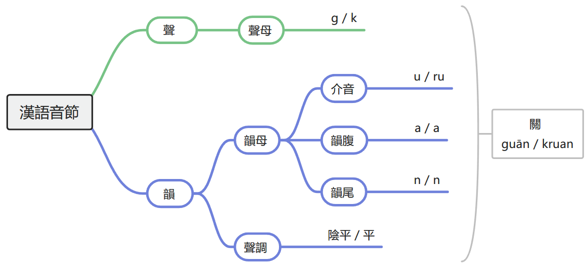

# Tone & Coda 聲調與韻尾

## 聲調

中古漢語是有聲調語言，分爲四種調類，其名字與中古漢語拼音標記是：平（無）、上（-x）、去（-h, -d）、入（-p, -t, -k）。由於漢語中聲調調值變化繁複且不規則，中古漢語中每個字具體的調值已經無法考證了，但每個字屬於哪個調類是可以確定的。

聲母清濁和四聲兩兩組合，一共有如下的十六種搭配，在漢語演化過程中同一種搭配的字在後世的聲調一般也屬於同一類。

||全清|次清|全濁|次濁|
|-|-|-|-|-|
|平|東 tung|通 thung|同 dung|籠 lung|
|上|董 tungx|桶 thungx|動 dungx|攏 lungx|
|去|凍 tungh|痛 thungh|洞 dungh|弄 lungh|
|入|督、篤 tuuk|禿 thuk|讀 duk|鹿 luk|

普通話的陰平、陽平分別來自中古漢語平聲字中聲母為清音、濁音的字。中古漢語全濁的上聲字在普通話中變去聲，其餘的上、去聲不變。中古漢語入聲調的全濁聲母字變陽平，次濁聲母字變去聲，清聲母字聲調隨機變化。另外，由於普通話失去了全濁聲母，平聲的全濁聲母字變送氣清音，仄聲的全濁聲母字變不送氣清音。

粵語廣州話有九個聲調，也來自中古漢語。平上去入各分陰陽，依據依然是聲母在中古漢語中的清濁。全濁上有文白異讀現象，白讀為陽上送氣，文讀為陽去不送氣。陰入按照韻母長、短，還要分爲上、下陰入。

## 韻尾

中古漢語中的韻尾種類與其中古漢語拼音如下圖：

韻尾要單獨拿出來和聲調一起講，是因爲它們的搭配是有限制的：

||一般陰聲韻|陽聲韻|“次入韻”|入聲韻|
|-|-|-|-|-|
|平|+|+|-|-|
|上|+|+|-|-|
|去|+|+|+|-|
|入|-|-|-|+|

一般認爲中古漢語的入聲韻尾和現代的閩語、粵語、客家話一樣，無可聼除阻。

一些多音節詞音節坍塌產生的新語素有 -p 尾，如：

* 二十 njiih zjip > njip 廿（不規則）
* 三十 sam zjip > sap 卅
* 四十 siih zjip > sip 卌
* 何不 gha p(yot) > ghap 盍

普通話中，陰聲韻完全保留；陽聲韻中 -m 韻尾合并入 -n，其餘不變；入聲韻 -k 文讀脫落，白讀中可能變爲 -i -u 韻尾，其餘全部隨著入聲的消失脫落變成陰聲韻。

普通話母語者識別閉口韻的方法：

* -m 尾，普通話 -n 尾字聲符凡：品稟凡風氾乏𡕢朕曇覃恬冘貪炎臽詹忝南男冉染壬念侵心兓三彡參（㐱聲符 -n）宋斬尖毚暹韱蘸芟尋罙甚占針夾閃今（矜 king）金贛函欠弇甘敢監咸僉兼喦广淫奄音猒林臨
* -p 尾，普通話無韻尾字聲符凡（但少數有去聲字或 -t 尾字）：乏入沓眔荅𦐇耴枼占疊内聶念咠集歰妾讋雜帀疌戢臿燮䪞溼十執習襲涉合劦及急去夾甲㬎業曄邑奄猒巤
* -p 尾，普通話無 /u/ 韻尾，日語有う尾。

粵語廣州話除了部分 -m -p 韻尾字變成 -n -t 韻尾字之外，完全繼承了中古漢語韻尾。越南語比粵語保存得更好，只有 -ng 和 -k 在文字上區分成了 -ng -nh 和 -c -ch，發音根本沒有變化。朝鮮語中除了 -t 韻尾變成 -l 以外沒有變化。

日語中韻尾的變化格外複雜。

|中古漢語輔音韻尾|日語韻尾|
|-|-|
|陰聲韻|-、い -i、う -u|
|-m|ん -n|
|-n|ん -n|
|-ng|い -i、う -u|
|-p|ふ -pu > う -u、っ|
|-t|つ -tu、ち -ti、っ|
|-k|く -ku、き -ki、っ|

|う尾的變化|例字|發音演化|
|-|-|-|
|あう > おう|康 khang|かう > こう|
|やう > よう|將 ciang|しゃう > しょう|
|えう > よう|鳥 teux|てう > ちょう|
|いう > ゆう|柔 nju|じう > じゅう|

-p 韻尾在日語中的變化尤其複雜，不僅經歷了ハ行轉呼，而且有因爲固定爲多音節詞而保留了古代發音的例外：

|例字|中古漢語拼音|日語音讀演化|例外|
|-|-|-|-|
|甲|krap|かふ kapu > kau > kou こう||
|法|pyap|はふ papu > hau > hou ほう||
|十|zjip|じふ zipu > jiu > juu じゅう|「十分（じっぷん）」不變|
|蝶|dep|てふ tepu > teu > tyou ちょう||
|雜|zap|ざふ zapu > zau > zou ぞう|「雜志（ざっし）」不變|

