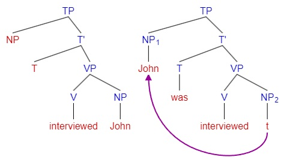

# Lec5 Movement

PS rule 的局限性：

* 不能生成一些表示强调的倒装句，比如：$NP_{2}\ S→NP_2\ NP_1\ Aux\ V$，例句：This problem, I can solve.
* 不能生成 particle movement。生成 bring in the man 很容易，生成 bring the man in 就很难了
* 不能 capture the relatedness of some structures，比如英语中疑问、被动句与陈述句语序的句子应该是有关系的

于是，Chomsky 提出：There is another component - transformation - that co-exists and complements the PS components. 人类的自然语言是唯一存在移位的语言，Baker 说：移位的存在不是出于逻辑上的需要，它深深根植于我们人类语言的性质中

Movement operations target both phrasal and terminal categories. 移位之前的形态称为“基础生成的”

Phrasal movement:

* Wh-movement: Wh-questions, relativization, topicalization
* NP-movement: Passivization, raising

## Head movement

### Affix-Hopping

这是个解决句子层面的 tense 具体要跟句中哪个成分结合的理论

观察英语句子中 tense 的分布:

1. if no auxiliary, tense shows up on the main verb. e.g. John sings / sang.
2. if contains one auxiliary, then it shows the tense. e.g. John will / would sing.
3. if contains more than one auxiliary, then tense shows up on the leftmost one. e.g. John will / would have sung.
4. each sentence can contain at most one marking for tense

Chomsky's solution: Tense (T) occupies the highest position relative to other predicative terminals. It then lowers to the nearest terminal in the derivation, due to its affixal nature. 即：最基本的句法树是 $[NP_{subject}][T\ Modal\ Aux\ V]$，然后时态会从左到右尝试与句子中的成分结合

e.g. T-to-V Lowering in the Main Verb of "$[_S[_{NP}Mary][_T -ed][_{VP}solve\ the\ problem].]$"

> 为什么能确定是 tense 往右与动词结合，而不是 V-to-T Raising 呢？
>
> Diagnotics：尝试在主语和动词中间加一个 VP-adverb，"Mary t cleverly [solve -ed] the problem"。如果是动词移位到 tense 处去和它结合的话，VP-adverb 就应该被挤到 [动词 + Tense] 的后面。法语的动词就是 V-to-T Raising 的，动词为了和 tense 结合，会穿过前面的 VP-adverb。

allomorph 语素变体：will + ed = would, walk + ed = walked, go + ed = went，屈折语中 tense 和其他语素结合时，语素发生形态变化

Do-Support: 只有 main verb 的疑问句，被 Neg 阻止了 affix hopping 的否定句，在 affix-hopping 的规则下没有成分来承接 tense，就让助动词 do 上去救场，避免 stranded affix

### T-to-C Movement

也称作 Subject-Aux Inversion，一般疑问句（yes/no question）中需要 raise tense to complementizer

"Can Bill solve the problem?" 的解释

1. $[_C[+Q][_{TP}Bill[_Tcan][_{VP}solve\ the\ problem]]]$
2. $[_C[_{+Q}Can]_i[_{TP}Bill[_Tt]_i[_{VP}solve\ the\ problem]]]$

助动词的情况："Was John at home?"

1. derived sentense: $[_{CP}[+Q][_{TP}John[_TTense][_{VP}be\ at\ home]]]$
2. verb raising：$[_{CP}[+Q][_{TP}John[_T[_Vbe]_i\ Tense][_{VP}[_Vt]_iat\ home]]]$
3. T-to-C: $[_{CP}[_{+Q/Aux/C}[_Vbe]_i\ Tense][_{TP}John[_Tt]_i[_{VP}[_Vt]_iat\ home]]]$

## Phrasal Movement - NP Movement

NP-movement refers to a transformation by which an NP lands at an argument, in particular, subject position.

### Passive

In the active-passive pair, the semantic relations (argument structure) and the c-selection requirement are the same, but the grammatical functions change. NP-movement in this case is to move the NP object to an empty subject position. This kind of subject is "Object-Subject".

demote/promote 降级/升级：主语变宾语，宾语变主语

### Raising

Raising is when the subject of an embedded clause moves to the subject position of a higher clause:

* Expletive (pleonastic) subject: It seems (that) Mary has solved the problem.
* Raised subject: Mary seems to have solved the problem.

Raising Verbs/Predicates：允许出现 raising 的动词，包括 seem、appear、be likely to、be certain to

Infinitive/Finite clause 不定式/定式：whether the main verb in the clause is tensed or non-tensed. Raising is possible only when the embedded clause is infinitival, 即“Mary seems has solved the problem”是不行的，只能是“Mary seems to have solved the problem”

## Wh-Movement

A wh-phrase is moved to a [Spec, C'] to make the sentence interpreted as a special question（特殊疑问句）. The landing site of wh-phrase is the specifier of CP. This is probably the most interesting and important movement.

Wh-move can apply to NP, PP, AP and CP, whereas TP and VP do not undergo wh-movement:

* Which man will David see t?
* Who should John talk to t? (Preposition stranding)
* To whom can John talk t? (Pied-piping)
* How disappointed is Fred t?
* What does Don believe t?

In echo questions, the wh-phrase returns to where the trace was. In multiple questions, only one wh-phrase is moved, and the others leave unchanged. These are how we know where the wh-phrase move from. wh-phrases move from independently needed structural positions associated with particular grammatical functions.（“独立必要的”是什么意思？它们不受其他成分影响，但构成特殊疑问句一定需要它们，这样理解对吗？）

* Echo questions: You talked to WHO?!
* Multiple questions: Which prize did we award to which scientist this year?

题外话，Linguists generally think different layers of phrases have different functions:

* VP: domain of the basic argument structure, the layer of semantics
* TP: domain of grammatically functional elements
* CP: discoursal domain. C has the function of clausal typing, whether it is a declarative, interrogative or imperative clause.

Wh-movement can produce unbounded dependency，也就是说 wh-phrase 和 trace 在句法树上的位置可以距离无穷多层成分：I wonder [who Mary believes [(that) Fred knows [(that) I asserted [(that) John saw t]]]]?

C-trace constraint: A filled C is not allowed when adjacent to the trace of a wh-moved subject. e.g. Who did you say [<del>that</del> t likes John]?
